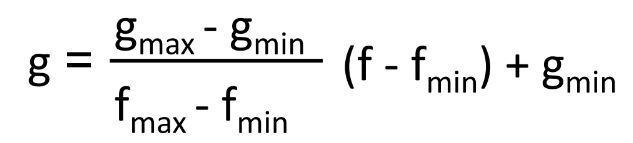
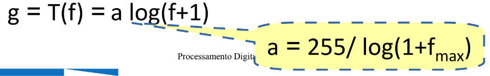
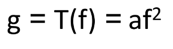
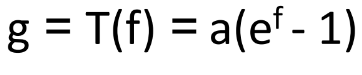

# Alargamento de Contraste

### Transfomação Linear

### Transformação Logaritimo
Maior realce nos pixels de baixa intensidade (regiões escuras)

### Transformação Qadrática
Aumenta o contraste em regiões de média e alta intensidade

### Transformação Exponencial
Aumenta o contraste em regiões de alta intensidade (regiões claras)

